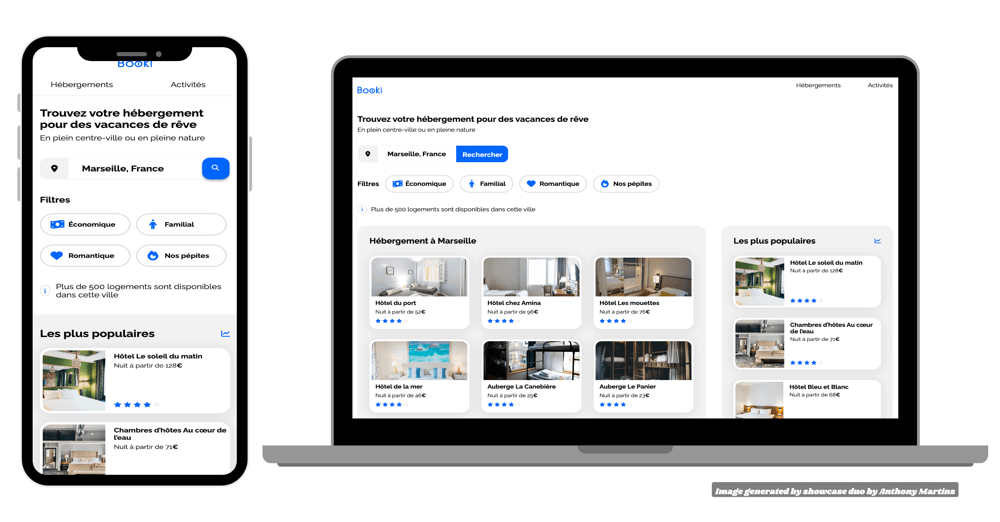

# Booki - Page d'accueil d'une agence de voyage avec HTML & CSS

## Aperçu du projet

## Description du projet

Réalisation dans le cadre de ma formation d'intégrateur web chez [OpenClassrooms](https://openclassrooms.com/fr/).  
Dans ce projet, j'ai développé la page d'accueil d'une agence de voyage en utilisant HTML et CSS.  
Mon objectif principal était d'intégrer une interface utilisateur responsive en suivant les maquettes fournies pour les versions mobile, tablette et desktop.  
En utilisant les fichiers de base fournis, j'ai complété le code HTML et CSS pour correspondre fidèlement aux designs.

## Démo en ligne  

[Booki sur GitHub Pages](https://martins-anthony.github.io/Booki/)

## Maquette Figma 

[Maquette Booki sur Figma](https://www.figma.com/design/B3eLowtWREc9YXzBcGRAHn/Maquettes-Booki)

## Objectifs

- **Intégration une interface responsive** : Utiliser HTML et CSS pour créer une page d'accueil qui s'adapte à différentes tailles d'écran (mobile, tablette, desktop).
- **Création de composants d'interface** : Développer des composants HTML et CSS sur mesure en accord avec les maquettes fournies.
- **Compréhension de la structure de code** : Acquérir une meilleure compréhension de la structuration et du stylage du code pour répondre aux exigences de design.

## Étapes du projet

1. **Découpage de la maquette** pour identifier les éléments HTML nécessaires et définir la structure de la page en conséquence, en divisant la maquette en sections logiques pour une intégration fluide.
2. **Header** avec Flexbox pour positionner le logo et les éléments de navigation, en m'assurant que les bordures et les marges respectaient les spécifications des maquettes.
4. **formulaire de recherche** qui s'adapte selon le type de dispositif (desktop ou mobile), en gérant l'affichage conditionnel des éléments textuels et des icônes.
5. **filtres de navigation** avec Flexbox pour organiser les filtres de manière horizontale et implémenté des changements de couleur de fond au survol des filtres.
6. **Cartes d'hébergement** affichant des informations sur les hébergements, en suivant le design vertical des cartes et en utilisant la propriété CSS `object-fit` pour gérer l'affichage des images.
7. **Sections** "Hébergements à Marseille" et "Les plus populaires" en dupliquant et en modifiant les cartes créées, tout en assurant que la mise en page respectait l'ordre d'affichage spécifié pour chaque taille d'écran.
8. **Cartes d'activités** en utilisant une disposition à quatre colonnes, en utilisant Flexbox pour garantir une présentation cohérente et uniforme.
9. **Footer** trois colonnes égales en utilisant Flexbox, vérifiant que le contenu était bien aligné et respectait les spécifications des maquettes.
10. **Optimisation responsive avec media queries** pour ajuster la mise en page aux tailles d'écran de tablette et mobile, en m'assurant que les éléments s'affichaient correctement et que les sections changeaient d'ordre lorsque nécessaire.
11. **Validation et debugging** j'ai vérifié que le site était conforme aux validateurs HTML et CSS du W3C, en m'assurant que le code était propre et que tous les liens et imports fonctionnaient correctement.

## Résultats attendus

- **Page d'accueil entièrement responsive** : La page fonctionne correctement sur mobile, tablette et desktop.
- **Intégration fidèle aux maquettes** : Le design correspond aux spécifications fournies par l'UI designer.
- **Code conforme et optimisé** : Le code HTML et CSS est propre, valide, et respecte les meilleures pratiques du développement web.

## Outils utilisés

- 
 : Éditeur de code pour le développement.
-  : Outil de design pour accéder aux maquettes du projet.
- ** et ** : Pour les polices de caractères et les icônes.
-  : Pour la mise en page responsive.
-  : Pour valider le HTML et le CSS.

## Auteur

  
